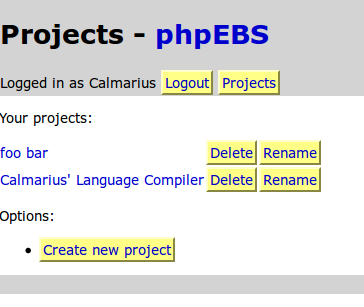
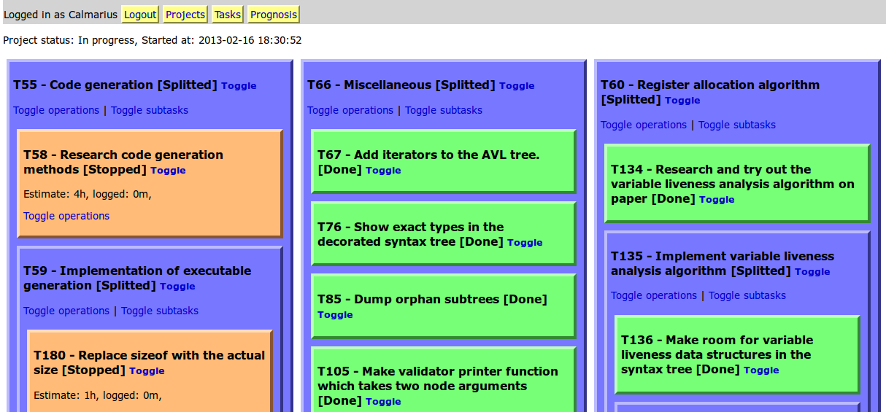
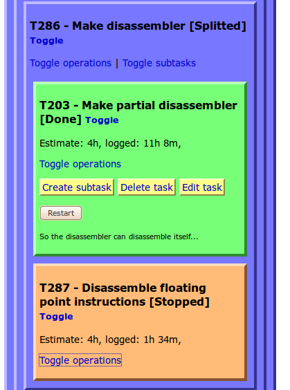
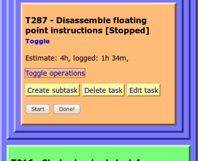
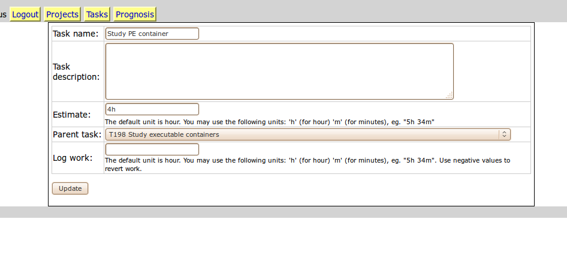
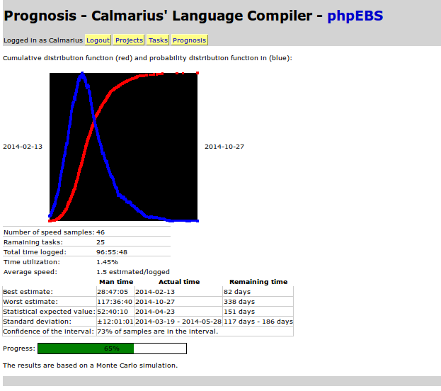

PHPEBS

This is a personal PHP/MySQL task/project management software. 
It implements evidence based scheduling (http://en.wikipedia.org/wiki/Evidence-based_Scheduling)
to estimate when will the project finishes.

REQUIREMENTS

- PHP (I haven't checked which minimum version this would work, but it's probably ok with v5 or above)
- MySQL
- A MySQL database and an user with all permissions on it (eg. stored procedures).

INSTALLATION

- Download the whole stuff.
- Put it into a folder in your webserver. 
- Open index.php. It will ask for your MySQL username, MySQL password, MySQL database name and other miscellaneous stuff.
  After installing it should work. You can register and log in.

SCREENSHOTS

